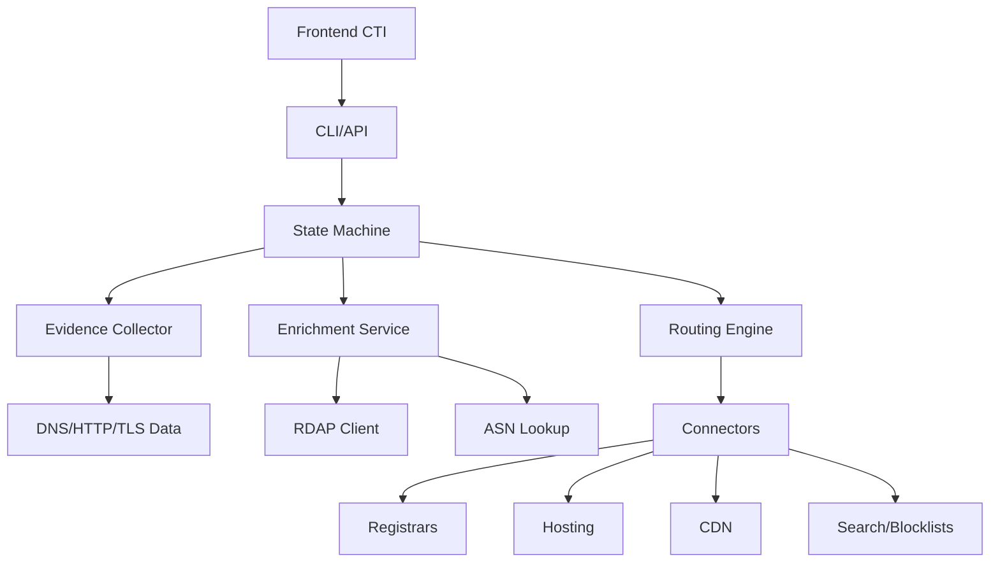

# CTI Takedown Tool 🚀

Automated system to orchestrate takedowns of malicious domains and URLs with evidence collection, SLA tracking and pluggable connectors.
[Portuguese version](README.pt-BR.md)


## ✨ Features
- Automated evidence collection (DNS, HTTP, TLS, screenshots)
- Abuse contact discovery via RDAP/WHOIS/ASN
- State machine with 9 steps
- Pluggable connectors (registrars, hosting, CDN)
- SLA tracking with automatic follow‑ups
- Customizable email templates (EN/PT)
- CLI and daemon modes

## 🏗️ Architecture


## 🚀 Quick Start
```bash
git clone https://github.com/bob-reis/cti-takedown-tool.git
cd cti-takedown-tool
go build -o takedown cmd/takedown/main.go
./takedown --help
```

## 📚 Documentation
Detailed guides are available in the [docs](docs/README.md) folder.

- [Architecture](docs/architecture/README.md)
- [Installation](docs/installation/README.md)
- [API Reference](docs/api/README.md)
- [Development](docs/development/README.md)
- [Deployment](docs/deployment/README.md)
- [Troubleshooting](docs/troubleshooting/README.md)
- [Portuguese documentation](docs_pt-BR/README.md)

## 🧪 Testing
```bash
./test.sh
```

## 📝 License
MIT License. See [LICENSE](LICENSE).

## 🌐 Links
- Issues: https://github.com/bob-reis/cti-takedown-tool/issues
- Email: bobreis@yeslinux.com.br

*Automating cyber‑threat takedowns, one domain at a time.*
