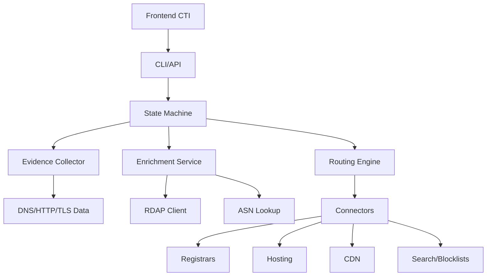

# CTI Takedown Tool 🚀

[](https://golang.org)
[](LICENSE)
[](#testing)
[](#testing)
[](https://sonarcloud.io/summary/new_code?id=bob-reis_site-takedown)
[](https://sonarcloud.io/summary/new_code?id=bob-reis_site-takedown)
[](https://sonarcloud.io/summary/new_code?id=bob-reis_site-takedown)

**Ferramenta automatizada para orquestração de takedowns de domínios/URLs maliciosos**

Sistema completo de CTI (Cyber Threat Intelligence) para automatizar o processo de takedown de infraestrutura maliciosa, implementando as melhores práticas da indústria e conformidade com políticas internacionais.

## 🎯 **Features Principais**

- 🔍 **Coleta Automática de Evidências**: DNS, HTTP, TLS, screenshots
- 🌐 **Descoberta Inteligente de Contatos**: RDAP, WHOIS, ASN lookup
- ⚡ **State Machine Completa**: 9 estados de orquestração automática
- 🔌 **Connectors Plugáveis**: GoDaddy, Registro.br, hosting genérico
- ⏰ **SLA Tracking**: Follow-ups automáticos e escalação inteligente
- 📧 **Templates Customizáveis**: PT/EN para diferentes targets
- 🖥️ **CLI + Daemon**: Uso interativo ou integração automática
- 🛡️ **Segurança**: Defang automático, coleta isolada, auditoria completa

## 🏗️ **Arquitetura**



## 🚀 **Quick Start**

### Instalação

```bash
# Clone o repositório
git clone https://github.com/bob-reis/cti-takedown-tool.git
cd cti-takedown-tool

# Build
go build -o takedown cmd/takedown/main.go

# Verificar instalação
./takedown --help
```

### Uso Básico

```bash
# Submeter URL de phishing
./takedown -action=submit -ioc="https://fake-bank.com/login" -tags="phishing,brand:MyBank"

# Verificar status de caso
./takedown -action=status -case=tdk-abc-123

# Listar todos os casos
./takedown -action=list

# Executar como daemon (para integração)
./takedown -daemon
```

## 📋 **Fluxo de Processo**

```
┌─────────────┐   ┌─────────────┐   ┌─────────────┐   ┌─────────────┐
│ Discovered  │──▶│   Triage    │──▶│Evidence Pack│──▶│    Route    │
└─────────────┘   └─────────────┘   └─────────────┘   └─────────────┘
       │                                                       │
       ▼                                                       ▼
┌─────────────┐   ┌─────────────┐   ┌─────────────┐   ┌─────────────┐
│   Closed    │◀──│   Outcome   │◀──│ Follow-up   │◀──│   Submit    │
└─────────────┘   └─────────────┘   └─────────────┘   └─────────────┘
```

### Estados do Sistema

1. **Discovered** → IOC recebido do frontend
2. **Triage** → Análise inicial de validade e prioridade
3. **Evidence Pack** → Coleta automática de evidências técnicas
4. **Route** → Descoberta de contatos e determinação de ações
5. **Submit** → Envio para targets (registrar/hosting/CDN)
6. **Submitted** → Aguardando primeira resposta (SLA tracking)
7. **Follow-up** → Acompanhamento ativo com lembretes
8. **Outcome** → Resolução (sucesso/falha/escalação)
9. **Closed** → Caso finalizado com métricas

## 🔧 **Configuração**

### 1. Configurar SMTP
```yaml
# configs/smtp.yaml
smtp:
  host: "smtp.company.com"
  port: 587
  username: "takedown@company.com"
  password: "password"
  from: "CTI Security Team <takedown@company.com>"
```

### 2. Ajustar SLAs
```yaml
# configs/sla/default.yaml
registrar:
  first_response_hours: 48
  escalate_after_hours: 120
  retry_interval_hours: 48

hosting:
  first_response_hours: 24
  escalate_after_hours: 96
  retry_interval_hours: 24
```

### 3. Customizar Routing
```yaml
# configs/routing/rules.yaml
rules:
  - match: ["phishing", "brand:*"]
    actions: ["registrar", "hosting", "search", "blocklists"]
  - match: ["c2", "critical"]
    actions: ["hosting", "registrar"]
    sla_override: "critical"
```

## 🎯 **Integração com Frontend**

### Botão de Takedown
```javascript
// Exemplo de integração
function requestTakedown(domain, category, brand) {
    const command = `./takedown -action=submit -ioc="${domain}" -tags="${category},brand:${brand}"`;
    
    // Executar via API ou subprocess
    fetch('/api/takedown', {
        method: 'POST',
        body: JSON.stringify({
            ioc: domain,
            type: 'domain',
            tags: [category, `brand:${brand}`]
        })
    });
}
```

### API REST (Futuro)
```bash
# POST /api/v1/takedown
curl -X POST http://localhost:8080/api/v1/takedown \
  -H "Content-Type: application/json" \
  -d '{
    "ioc": "malicious-domain.com",
    "type": "domain", 
    "tags": ["phishing", "brand:TestBank"],
    "priority": "high"
  }'
```

## 📊 **Targets Suportados**

### Registrars
- ✅ **GoDaddy**: Email automático para abuse@godaddy.com
- ✅ **Registro.br**: Handling especial para domínios .br
  - Brand disputes → SACI-Adm
  - Content abuse → Hosting + CERT.br coordination
- ✅ **Generic**: Detecção automática para outros registrars

### Hosting/ISP
- ✅ **ASN Detection**: Lookup automático de provedores
- ✅ **Abuse Contacts**: Mapeamento inteligente de emails
- ✅ **Template Engine**: Emails personalizados por categoria

### CDN & Others
- ✅ **Cloudflare**: Formulário de abuse + hosting origin
- ✅ **Search Engines**: Google Safe Browsing, Microsoft SmartScreen
- ✅ **Blocklists**: URLhaus, Spamhaus, APWG

## 🧪 **Testing**

O sistema possui cobertura completa de testes unitários para validar toda a lógica sem afetar domínios reais:

```bash
# Executar todos os testes
./test.sh

# Testes específicos
go test ./pkg/models/... -v      # Models e estruturas
go test ./internal/routing/... -v # Engine de roteamento
go test ./pkg/rdap/... -v        # Cliente RDAP
go test ./internal/evidence/... -v # Coletor de evidências

# Com coverage
go test -coverprofile=coverage.out ./...
go tool cover -html=coverage.out
```

### Coverage Atual
- **Models**: 95%+ (IOC, Evidence, Contacts, Takedown)
- **RDAP Client**: 90%+ (com mocks de servidor)
- **Evidence Collector**: 85%+ (com HTTP mocks)
- **Routing Engine**: 100% (todas as regras testadas)

## 📚 **Documentação Detalhada**

- 📖 **[Arquitetura](docs/architecture/README.md)** - Design e componentes do sistema
- 🔧 **[Instalação](docs/installation/README.md)** - Guia completo de setup
- 🚀 **[API Reference](docs/api/README.md)** - CLI e API documentation
- 👨‍💻 **[Development](docs/development/README.md)** - Guia para desenvolvedores
- 🚀 **[Deployment](docs/deployment/README.md)** - Deploy em produção
- 🔍 **[Troubleshooting](docs/troubleshooting/README.md)** - Resolução de problemas

## 🔒 **Segurança & Conformidade**

### Segurança Operacional
- ✅ **Defang Automático**: Todos os IOCs são defanged em comunicações
- ✅ **Ambiente Isolado**: Coleta de evidências em sandbox
- ✅ **Validação de Inputs**: Sanitização completa de dados
- ✅ **Auditoria Completa**: Log de todas as ações com timestamps
- ✅ **Templates Seguros**: Nenhuma exposição de dados sensíveis

### Conformidade
- ✅ **ICANN DNS Abuse Policy**: Implementação conforme diretrizes
- ✅ **GDPR Compliance**: Não coleta dados pessoais desnecessários
- ✅ **Industry Best Practices**: RFC compliance para RDAP/WHOIS
- ✅ **Brazilian .br Process**: SACI-Adm e CERT.br integration

## 📈 **Métricas e Monitoring**

### KPIs Rastreados
- **MTTA** (Mean Time To Acknowledge): Tempo até primeira resposta
- **MTTR** (Mean Time To Resolution): Tempo até resolução completa
- **Taxa de Sucesso**: Por registrar, hosting, categoria
- **Top Problemas**: TLDs/ASNs mais recorrentes
- **Reincidência**: Domínios/IPs que retornam

### Dashboards
```bash
# Status de casos ativos
./takedown -action=list

# Métricas detalhadas (futuro)
./takedown -action=metrics --period=30d
```

## 🤝 **Contributing**

Contribuições são bem-vindas! Por favor:

1. **Fork** o repositório
2. **Create feature branch**: `git checkout -b feature/amazing-feature`
3. **Commit changes**: `git commit -m 'Add amazing feature'`
4. **Run tests**: `./test.sh`
5. **Push branch**: `git push origin feature/amazing-feature`
6. **Open Pull Request**

### Desenvolvimento Local
```bash
# Setup ambiente de desenvolvimento
make dev-setup

# Executar em modo desenvolvimento
make dev-run

# Executar testes continuamente
make test-watch
```

## 📝 **License**

Este projeto está licenciado sob a MIT License - veja o arquivo [LICENSE](LICENSE) para detalhes.

## 🆘 **Suporte**

- 🐛 **Issues**: [GitHub Issues](https://github.com/bob-reis/cti-takedown-tool/issues)
- 📧 **Email**: bobreis@yeslinux.com.br

## 🗺️ **Roadmap**

### v1.1 (Próximo)
- [ ] API REST completa
- [ ] Dashboard web para monitoramento
- [ ] Integração com MISP/OpenCTI

---

*Automatizando a defesa contra ameaças cibernéticas, um domínio por vez.*
