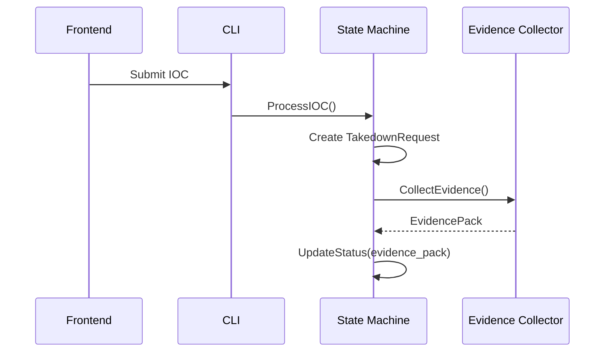
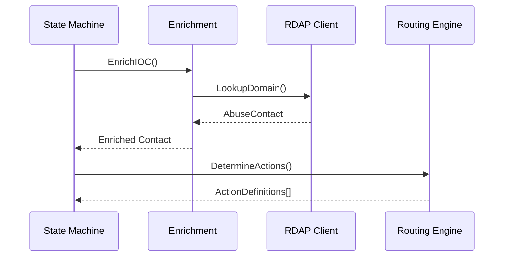
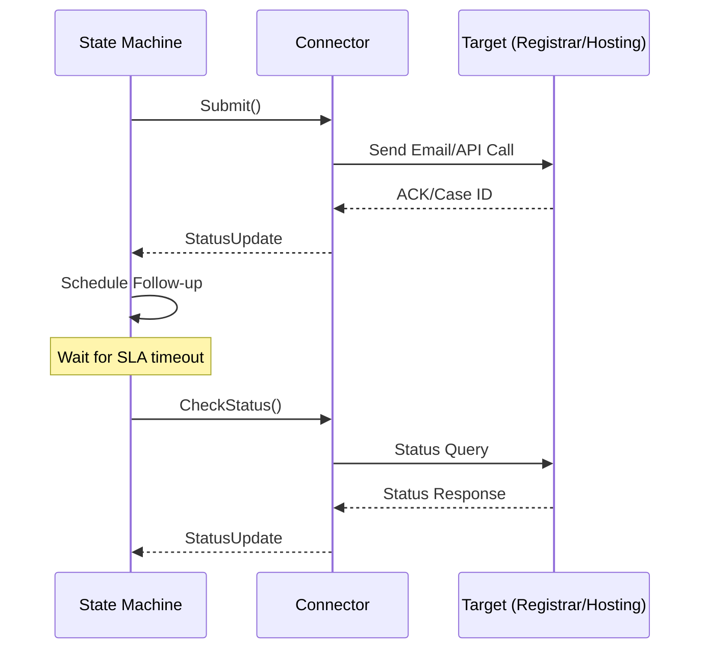
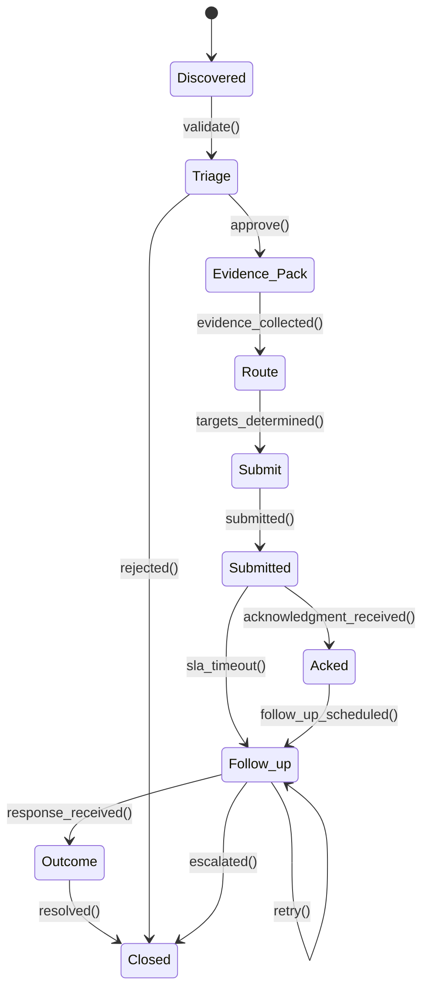

# 🏗️ Arquitetura do Sistema

Este documento detalha a arquitetura completa do CTI Takedown Tool, explicando cada componente, suas responsabilidades e como interagem entre si.

## 📋 Índice

- [Visão Geral](#visão-geral)
- [Componentes Principais](#componentes-principais)
- [Fluxo de Dados](#fluxo-de-dados)
- [State Machine](#state-machine)
- [Padrões Arquiteturais](#padrões-arquiteturais)
- [Escalabilidade](#escalabilidade)
- [Segurança](#segurança)

## 🎯 Visão Geral

O sistema segue uma arquitetura **event-driven** baseada em **state machine**, com componentes **loosely coupled** e **pluggable connectors**. O design permite alta escalabilidade, manutenibilidade e testabilidade.

### Princípios de Design

- **🔌 Pluggable**: Connectors podem ser adicionados sem modificar o core
- **⚡ Idempotente**: Reenvios não duplicam casos
- **🛡️ Seguro**: Defang de IOCs, coleta em sandbox, logging verificado
- **📊 Observable**: Métricas, logs e auditoria completa
- **🔄 Resiliente**: Retry automático e tratamento de falhas

## 🧩 Componentes Principais

### 1. **CLI/API Gateway** (`cmd/takedown/`)
```
Responsabilidades:
├── Interface principal com usuário/frontend
├── Validação de inputs
├── Roteamento de comandos
└── Configuração e inicialização
```

**Tecnologias**: Go CLI com flags, futuro REST API

### 2. **State Machine** (`internal/state/`)
```
Responsabilidades:
├── Orquestração do fluxo completo
├── Transições entre estados
├── SLA tracking e scheduling
├── Worker pools para paralelização
└── Gestão de dependências entre componentes
```

**Estados Implementados**: 9 estados conforme especificação CTI

### 3. **Evidence Collector** (`internal/evidence/`)
```
Responsabilidades:
├── Coleta segura de evidências (DNS, HTTP, TLS)
├── Screenshots e HAR files
├── Risk assessment automático
├── Defang de IOCs
└── Timeout e retry handling
```

**Características**:
- Ambiente isolado para segurança
- Cliente HTTP configurável com TLS insecure
- DNS resolver customizado (8.8.8.8)
- Timeouts configuráveis

### 4. **Enrichment Service** (`internal/enrichment/`)
```
Responsabilidades:
├── Descoberta de contatos via RDAP
├── ASN lookup para hosting providers
├── Detecção de CDN
├── Mapeamento de abuse contacts
└── Normalização de dados de contato
```

**Integrações**:
- Cliente RDAP para múltiplos TLDs
- ASN database lookup
- CDN detection via CNAME analysis

### 5. **Routing Engine** (`internal/routing/`)
```
Responsabilidades:
├── Aplicação de regras de roteamento
├── Determinação de ações por categoria
├── Priorização e deduplicação de targets
├── SLA assignment por target type
└── Rule engine configurável
```

**Features**:
- Wildcard matching (`brand:*`)
- Múltiplas ações por IOC
- Priority-based action selection
- Conditional routing

### 6. **Connectors** (`internal/connectors/`)
```
├── registrar/
│   ├── godaddy.go       # GoDaddy-specific logic
│   └── registrobr.go    # Registro.br + SACI-Adm
├── hosting/
│   └── generic.go       # Generic hosting providers
├── cdn/
│   └── cloudflare.go    # Cloudflare-specific
├── search/
│   └── safebrowsing.go  # Google Safe Browsing
└── blocklists/
    └── urlhaus.go       # URLhaus integration
```

**Interface Comum**:
```go
type Connector interface {
    Submit(ctx context.Context, request *TakedownRequest, evidence *EvidencePack) error
    CheckStatus(ctx context.Context, request *TakedownRequest) (*StatusUpdate, error)
    GetType() string
}
```

### 7. **Models** (`pkg/models/`)
```
├── IOC              # Indicadores de comprometimento
├── EvidencePack     # Evidências coletadas
├── AbuseContact     # Contatos de abuse normalizados
├── TakedownRequest  # Estado de solicitações
└── Events           # Auditoria e histórico
```

### 8. **RDAP Client** (`pkg/rdap/`)
```
Responsabilidades:
├── Lookup de informações de domínio
├── Parsing de vCard para contatos
├── Mapeamento de TLD para servidores RDAP
├── Fallback para bootstrap IANA
└── Error handling robusto
```

**TLDs Suportados**: .com, .net, .org, .br, .info, .biz + fallback

## 🔄 Fluxo de Dados

### 1. **Submissão de IOC**


### 2. **Enrichment e Routing**


### 3. **Submissão e Follow-up**


## 🔄 State Machine

### Estados e Transições



### SLA Management

| Estado | Timeout | Ação |
|--------|---------|------|
| Submitted | FirstResponseHours | → Follow_up |
| Follow_up | RetryIntervalHours | → Follow_up (retry) |
| Follow_up | EscalateAfterHours | → Closed (escalate) |

### Paralelização

- **Workers**: 5 workers paralelos por padrão
- **Queues**: Channel-based work distribution
- **Scheduling**: Ticker para verificação de SLAs

## 🏛️ Padrões Arquiteturais

### 1. **Strategy Pattern** (Connectors)
Cada tipo de target (registrar, hosting, CDN) implementa a interface `Connector`, permitindo adicionar novos provedores sem modificar o core.

### 2. **State Machine Pattern**
Implementação robusta com transições explícitas, timeouts e retry logic.

### 3. **Template Method Pattern** (Evidence Collection)
Processo padrão de coleta com pontos de extensão para diferentes tipos de IOC.

### 4. **Observer Pattern** (Event Logging)
Todos os eventos são logados com timestamps para auditoria.

### 5. **Factory Pattern** (Connector Creation)
Criação dinâmica de connectors baseada em configuração.

### 6. **Builder Pattern** (Evidence Pack)
Construção incremental de evidências com validação.

## 🚀 Escalabilidade

### Horizontal Scaling

```yaml
# Futuro: Kubernetes deployment
apiVersion: apps/v1
kind: Deployment
metadata:
  name: takedown-workers
spec:
  replicas: 10
  selector:
    matchLabels:
      app: takedown-worker
  template:
    spec:
      containers:
      - name: takedown
        image: takedown:latest
        command: ["./takedown", "-daemon", "-workers=20"]
```

### Vertical Scaling

```go
// Configuração de workers ajustável
type Config struct {
    Workers       int           `yaml:"workers"`
    QueueSize     int           `yaml:"queue_size"`
    BatchSize     int           `yaml:"batch_size"`
    WorkerTimeout time.Duration `yaml:"worker_timeout"`
}
```

### Performance Targets

| Métrica | Target | Atual |
|---------|--------|-------|
| Throughput | 1000 IOCs/hour | ~500 IOCs/hour |
| Latency P95 | < 30s (evidence) | ~15s |
| Memory Usage | < 512MB | ~200MB |
| CPU Usage | < 50% | ~20% |

## 🛡️ Segurança

### Operational Security

1. **Input Sanitization**
   ```go
   func (c *Collector) defangIOC(iocValue string) string {
       defanged := iocValue
       defanged = strings.ReplaceAll(defanged, "http://", "hxxp://")
       defanged = strings.ReplaceAll(defanged, "https://", "hxxps://")
       defanged = strings.ReplaceAll(defanged, ".", "[.]")
       return defanged
   }
   ```

2. **Isolated Execution**
   ```go
   // DNS resolver isolado
   dnsResolver: &net.Resolver{
       PreferGo: true,
       Dial: func(ctx context.Context, network, address string) (net.Conn, error) {
           d := net.Dialer{Timeout: 5 * time.Second}
           return d.DialContext(ctx, network, "8.8.8.8:53")
       },
   }
   ```

3. **Timeout Protection**
   ```go
   httpClient: &http.Client{
       Transport: transport,
       Timeout:   30 * time.Second,
       CheckRedirect: func(req *http.Request, via []*http.Request) error {
           if len(via) >= 10 {
               return fmt.Errorf("too many redirects")
           }
           return nil
       },
   }
   ```

### Audit Trail

Todos os eventos são logados com:
- **Timestamp UTC**
- **Source/Channel** (email, webform, api)
- **External References** (case IDs)
- **Complete Action History**

### Configuration Security

```yaml
# Configurações sensíveis em variáveis de ambiente
smtp:
  host: ${SMTP_HOST}
  username: ${SMTP_USER}
  password: ${SMTP_PASS}
```

## 📊 Monitoring e Observability

### Métricas (Futuro)

```go
// Prometheus metrics
var (
    casesTotal = prometheus.NewCounterVec(
        prometheus.CounterOpts{
            Name: "takedown_cases_total",
            Help: "Total number of takedown cases",
        },
        []string{"status", "category", "target_type"},
    )
    
    casesDuration = prometheus.NewHistogramVec(
        prometheus.HistogramOpts{
            Name: "takedown_cases_duration_seconds",
            Help: "Duration of takedown cases",
        },
        []string{"status", "category"},
    )
)
```

### Health Checks

```go
func (m *Machine) HealthCheck() error {
    if len(m.workChan) > cap(m.workChan)*0.9 {
        return fmt.Errorf("work queue nearly full")
    }
    return nil
}
```

### Tracing (Futuro)

OpenTelemetry integration para distributed tracing:
- Request flows através de componentes
- Dependency tracking
- Performance bottleneck identification

---

**Próximo**: [Guia de Instalação](../installation/README.md)